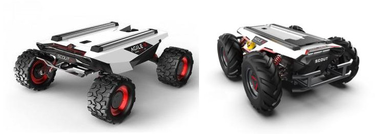
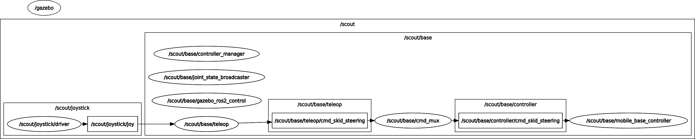

# scout_bringup

## 1) Overview

`scout_bringup` connects the Scout description, hardware, simulation and teleoperation packages to the generic `romea_mobile_base_meta_bringup` workflow.

It provides:

* robot-specific generation functions for configuration, URDF and `ros2_control` descriptions;
* launch files for live control, Gazebo simulation and teleoperation;
* controller manager and mobile base controller parameter files.

Scout mobile bases use the `4WD` architecture and the `skid_steering` command type. Their default controller is `romea_mobile_base_controllers/MobileBaseController4WD`.



## 2) Generated artifacts

The Python module `scout_bringup` delegates most generation work to `scout_description` and adds bringup-specific configuration such as the controller manager parameter file.

It provides the functions expected by `romea_mobile_base_meta_bringup`:

| Function | Purpose |
|---|---|
| `get_configuration(robot_model)` | returns the compact mobile base configuration for the selected model |
| `generate_configuration_file(robot_model, extended)` | generates the mobile base configuration file |
| `generate_urdf_description(prefix, mode, base_name, robot_model, ros_prefix)` | generates the selected Scout URDF description |
| `generate_ros2_control_description(prefix, mode, base_name, robot_model)` | generates the selected Scout `ros2_control` description |

The executable scripts in `scripts/` expose these functions from the command line.

The configuration generator writes the compact `4WD` mobile base configuration used by controllers, teleoperation and launch files. It is derived from the selected Scout configuration in `scout_description/config/`.

```bash
ros2 run scout_bringup generate_configuration_file.py \
  robot_model:mini \
  extended:false
```

The URDF generator writes the selected Scout robot description. It contains the `4WD` link and joint structure, inertial data, collision geometry, visual meshes and the simulator plugin block when a simulation mode is selected.

```bash
ros2 run scout_bringup generate_urdf_description.py \
  robot_namespace:scout \
  base_name:base \
  robot_model:mini \
  mode:simulation_gazebo_classic
```

The `ros2_control` generator writes the hardware description consumed by `controller_manager`. It declares the hardware plugin selected by the model and mode, the geometric hardware parameters and the command/state interfaces for the four wheel spinning joints.

```bash
ros2 run scout_bringup generate_ros2_control_description.py \
  robot_namespace:scout \
  base_name:base \
  robot_model:mini \
  mode:live
```

## 3) Launch files

### 3.1) Base launch

`launch/scout_base.launch.py` starts the selected Scout mobile base control stack.

It:

* receives the generated robot URDF and `ros2_control` description from the meta-bringup launch context;
* starts `controller_manager/ros2_control_node` in non-Gazebo modes;
* loads `joint_state_broadcaster`;
* loads `mobile_base_controller` using `romea_mobile_base_controllers/MobileBaseController4WD`;
* starts `romea_cmd_mux` and remaps its output to `controller/cmd_skid_steering`.

Main launch arguments are:

| Argument | Description |
|---|---|
| `mode` | execution mode, such as `live`, `simulation_gazebo` or `simulation_gazebo_classic` |
| `robot_model` | Scout model, either `mini` or `v2` |
| `robot_namespace` | namespace of the robot, defaulting to `scout` |
| `base_name` | namespace of the mobile base, usually `base` |

### 3.2) Teleoperation launch

`launch/scout_teleop.launch.py` starts the mobile base teleoperation stack through `romea_mobile_base_teleop`.

It uses:

* the selected Scout robot configuration from `scout_description/config/scout_<robot_model>.yaml`;
* the joystick configuration file, usually selected from the `config/` directory of `romea_joystick_utils` according to the joystick type;
* the teleoperation configuration from `scout_description/config/teleop.yaml` by default.

The teleoperation node publishes `romea_mobile_base_msgs/SkidSteeringCommand`, consistent with the Scout skid-steering command type.

To move the robot, the operator must hold either the slow mode or turbo mode button. The joystick axes then command the longitudinal and angular speeds.

Main launch arguments are:

| Argument | Description |
|---|---|
| `robot_model` | Scout model, either `mini` or `v2` |
| `joystick_topic` | joystick `sensor_msgs/msg/Joy` topic |
| `joystick_configuration_file_path` | joystick configuration file, usually selected from `romea_joystick_utils/config/` |
| `teleop_configuration_file_path` | teleoperation configuration file, defaulting to `scout_description/config/teleop.yaml` |


### 3.3) Gazebo launch

`launch/scout_gazebo.launch.py` starts a Gazebo or Gazebo Classic simulation and spawns the selected Scout entity from the generated URDF.

It supports:

* `simulation_gazebo`, using `ros_gz_sim` and `gz_ros2_control`;
* `simulation_gazebo_classic`, using `gazebo_ros` and `gazebo_ros2_control`.

The `ros2_control` hardware plugin used in simulation is selected by `scout_description` from the generated `mode`.

Main launch arguments are:

| Argument | Description |
|---|---|
| `mode` | simulation mode, usually `simulation_gazebo` or `simulation_gazebo_classic` |
| `robot_model` | Scout model, either `mini` or `v2` |
| `robot_namespace` | namespace of the robot and simulation entity |
| `base_name` | namespace of the mobile base, usually `base` |

### 3.4) Test launch

`launch/scout_test.launch.py` starts a compact test setup with:

* the Scout simulation when the selected mode contains `simulation`;
* the Scout base launch for the selected model;
* the Scout teleoperation launch;
* a joystick node using the selected joystick type.

In simulation mode, the controller manager is provided by the Gazebo Classic integration. In live mode, the base launch starts the standard `controller_manager/ros2_control_node`.

Main launch arguments are:

| Argument | Description |
|---|---|
| `mode` | execution mode, usually `simulation` for this test setup |
| `robot_model` | Scout model, either `mini` or `v2` |
| `joystick_model` | joystick model used to select the default joystick configuration, such as `microsoft_xbox` or `sony_dualshock4` |

The following diagram gives an overview of the control pipeline started by this test launch file.



## 4) Configuration files

The `config/` directory contains:

| File | Purpose |
|---|---|
| `controller_manager.yaml` | declares `joint_state_broadcaster` and `MobileBaseController4WD` |
| `mobile_base_controller.yaml` | provides common runtime parameters for the mobile base controller |

The robot geometry, inertia, joint names and teleoperation defaults are stored in `scout_description/config/`.

## 5) Relation with the meta-bringup workflow

`scout_bringup` is the robot-specific extension used when a mobile base meta-description selects:

```yaml
configuration:
  manufacturer: agilex
  model: scout
  version: mini
```

or:

```yaml
configuration:
  manufacturer: agilex
  model: scout
  version: v2
```

In that workflow:

* `romea_mobile_base_meta_bringup` reads the mobile base meta-description;
* `scout_bringup` generates Scout-specific configuration, URDF, `ros2_control` and launch artifacts;
* `scout_description` provides the concrete Scout Mini and Scout V2 models;
* `scout_hardware` is used in `live` mode;
* `romea_mobile_base_gazebo` or `romea_mobile_base_gazebo_classic` is used in Gazebo simulation modes;
* `romea_mobile_base_teleop` starts the matching skid-steering teleoperation node.
